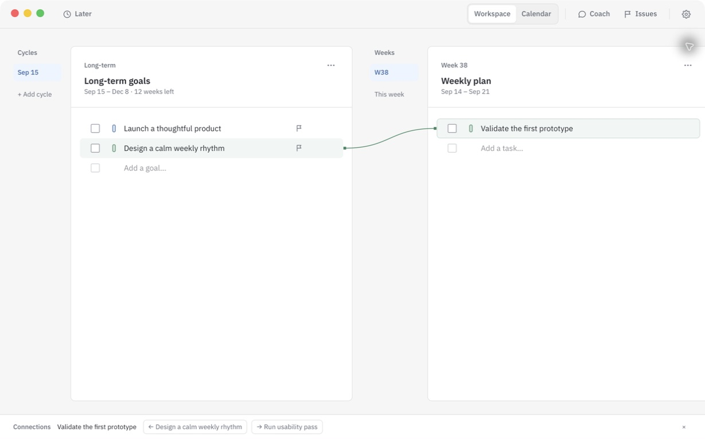

# Goal



[中文 README](README_zh.md)

Goal is a local-first personal planning app that keeps long-term goals, weekly plans, daily plans, and focus blocks on one continuous path. Tasks can exist independently or be linked to weekly and long-term goals; long-term goal colors carry through those relationships in Workspace and Calendar.

The current target release is `v0.1.4`. The desktop app, window, system menus, and installers consistently use **Goal**.

## Features

- Build plans at the long-term, weekly, and daily levels. Tasks may remain independent or be linked to a parent goal.
- Edit tasks, reorder them, update completion state, manage Later items, and see long-term goal colors in Workspace.
- View daily plans in Calendar month/week views, then arrange focus blocks in the one-day Plan and Schedule views.
- Configure your own cloud or local models (BYOK), with support for Anthropic Messages, OpenAI Chat Completions, and OpenAI Responses API formats.
- Use Coach for planning, goal clarification, prioritization, retrospectives, and time-block analysis. Operations that change local data go through a preview and confirmation flow first.
- Review rule-based planning Issues; after configuring and testing a model, run AI checks and dismiss or locate issues one at a time.
- Switch between Simplified Chinese and English, and configure the light theme, week start day, log level, and Coach context retention in Settings.

Voice input, cloud sync, and automatic updates are not available in `v0.1.4`. The app has no account system or telemetry; AI requests are made only when a user configures and invokes a provider.

## Downloads

Release assets are published on [Releases](https://github.com/LordCasser/goal/releases/latest). The current release convention is below; see the Release page for exact filenames and available assets:

| Platform | Target architecture | Expected assets |
| --- | --- | --- |
| Linux | `x86_64` | `.AppImage`, `.deb` |
| Linux | `aarch64` | `.AppImage`, `.deb` |
| Windows | `x86_64` | NSIS `.exe` (unsigned) |
| Windows | `aarch64` | NSIS `.exe` (unsigned) |
| macOS | `x86_64` | `.dmg` (fixed self-signed, not notarized) |
| macOS | `aarch64` | `.dmg` (fixed self-signed, not notarized) |

Runtime requirements: macOS 13.3 or later; Windows 10/11 with WebView2 111 or later; and an updated Ubuntu 22.04 or later distribution with WebKitGTK 4.1 and Secret Service on Linux. See the [cross-platform review](docs/cross-platform-review.md) for the native acceptance scope.

These are the six targets in the release workflow; they do not mean that every native runner build has been completed locally.

### Opening the app for the first time on macOS

The current macOS package does not have a Developer ID and is not notarized by Apple. Builds use a fixed certificate and designated-requirement self-signed identity so that later updates with the same signature retain their Keychain identity. Release preparation uses only a temporary keychain; it does not install a system trust anchor or change the user's trust settings. When moving from an older ad hoc package to the fixed-signature package, existing Keychain items may require one authorization; continuity checks confirm that later updates with the same signature do not prompt again because of a changed CDHash.

Gatekeeper may block the first launch. After confirming the package source and checking its digest, follow [Apple's instructions](https://support.apple.com/en-gb/102445) and use **Open Anyway** in System Settings → Privacy & Security. Do not disable Gatekeeper globally to install the app.

## Development

Requires Node.js `>=22.12.0` and Rust `>=1.88`.

```sh
npm ci
npm test

# Start the Tauri desktop development environment
npm run tauri -- dev

# Rust unit and integration tests
cargo test --manifest-path src-tauri/Cargo.toml --locked
```

Credential operations on Linux require Secret Service in the user's session, such as `gnome-keyring`. If the service is unavailable, credential operations fail explicitly rather than falling back to plaintext storage; other local planning features remain usable.

See [`docs/desktop-build.md`](docs/desktop-build.md) for desktop targets, platform configuration, pre-package checks, and signing boundaries. See [`docs/user-guide.md`](docs/user-guide.md) for usage instructions and [`docs/privacy.md`](docs/privacy.md) for data boundaries.

## Repository scope

The public repository contains maintainable source code, necessary documentation, and resources required for builds. Original reverse-engineering materials, third-party packaging sources, and local acceptance records are not part of the public release.

## License

The license file is maintained separately by the repository owner.
